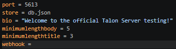
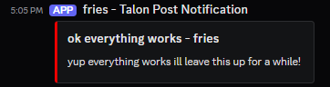

# Docs

- Quick note, everything here is as up-to-date as I can keep it, please help out if you notice anything wrong/misspelled/confusing.

## Setup
To run it, create `.env` in the main directory.\
In the dotenv add:

```
port=(int)
store=(str).json
bio=(str)
minimumlengthbody=(int)
minimumlengthtitle=(int)
webhook=(str)
```
\
Example:\
\
Webhook:\


Then run main.py and have users connect to it. More stuff will come in the future like server names so different Talon servers can be hosted for different reasons.
> [!NOTE]
> The **"fileloc"** in the .env setup should be something like "db.json" (wrapped in quotes) or it may not work, and the **"portnumber"** should be the integer value of the port you want to run the server on, default being 5613 though if I remember correctly that's not a good port for "production environments" but that's just what I was using, **bio** being a string that defines what topic or idea your instance is about. minimumlengthbody is an int that defines a minimum body length in messages, and minimumlengthtitle is the same for titles. These default to 25 and 5 respectively. The Webhook is for posting to discord or fluxer or originchats, really anything where you can post to it and it shows up like a message. It can also be some other webhook for automation, or something else.
## API
### Returns
`{"type": "get"}` returns `{"username": (str), "title": (str), "body": (str) "likes": (int)},` for the latest message.
For the count variation like the latest 10 messages, it slaps them in an json array, in order, still in this format.\
\
`{"type": "like", "number": "(int)", "username": "(str)"}` can return either `{"error": "you have already liked this post"}` if the user is in the posts liked array, or `{"success": "liked"}` if it is liked.\
\
`{"type": "post", "token": (str), "title": (str), "body": (str)}` returns: `{"status": "saved"}` if the post is saved. Returns: `{"error": "missing key data."}` if the post errors. This means that something, title, body, or username, either wasn't sent properly or was sent as less than the minimum required length. Title minimum is 5, Username minimum is 1, body minimum is 25, all except username are this by default but defined in the `.env`. (Read above.)\
\
`{"type" : "getbio"}` returns `{"success": (str)}` on success and `{"error": "bio is not set up or something errored"}` on failure, meaning either the bio wasnt sent properly or it was 0 characters long which should be handled before any of this happens but im dumb.\
\
`{"type" : "testauth", "token" : "(usertoken)"}` returns the username as a string or the word "error" as just a string. No json involved as this isn't meant to actually be used in clients, but is instead an internal function used in the code, that I figured would do no harm if publicly accessible.

### Posts
Create Post: `{"type": "post", "token": "(str)", "title": "(str)", "body": "(str)"}`\
Creates a post with the title and body specified. Token should always be the token of the logged in user via Rotur.\
\
Get Latest Post: `{"type": "get"}`\
Gets the latest post and returns it as the json specified in **Returns**.\
\
Get Posts Count: `{"type": "getcount", "count": "(int)"}`\
Gets the **n** latest posts where **n** is a positive integer.\
\
Search Post: `{"type": "search", "query": (str)}`\
Returns any message with the query string in username, title, or body as a json array.

## Post Editing / Info
Like post:`{"type": "like", "number": "(int)", "token": "(str)"}` \
(Will add a like to that number post)\
\
Delete post:`{"type": "deletepost", "postnumber": "(int)", "token": "(str)"}`\
Will delete that number post if user is the author, eventually if user is that or in sudousers.json

## Other Info
Get server Bio:`{"type" : "getbio"}`\
Gets the server's bio as is set by the host.\
\
Test authentication:`{"type" : "testauth", "token" : "(usertoken)"}`\
Can be used to test if the authentication is working, Talon, Rotur API, and client sided.

## Unimplemented:
Report post:`{"type": "report", "number": "(int)"}`\
(Will put that post in a reports.json file for the server host to look at)

Get specific item:`{"type": "getpostnum", "number": "(int)"}`
(Will get that specific number post.)

Replies: `{"type": "reply", "token": "(str)", "title": "(str)", "body": "(str)", "original": "(int)"}`\
Creates a reply with all the data like a new post, but semi links it to the original value. This being its integer, or its place in line.
